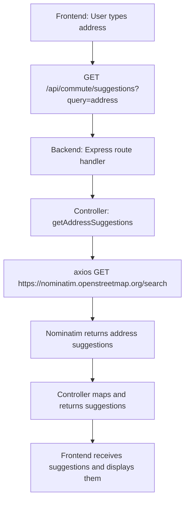

# Address Autocomplete API Documentation

## Endpoint

```
GET /api/commute/suggestions?query=YOUR_ADDRESS
```

## Description
Returns up to 5 address suggestions for any query, worldwide, using OpenStreetMap Nominatim.

## Example Response
```json
[
  {
    "address": "Full formatted address",
    "placeId": "Unique place ID",
    "lat": "Latitude",
    "lon": "Longitude"
  },
  ...
]
```

## Error Responses
- `400`: `{ "error": "Query parameter is required" }`
- `502`: `{ "error": "Address provider error", "details": ... }`
- `504`: `{ "error": "No response from address provider", "details": ... }`
- `500`: `{ "error": "Failed to fetch address suggestions", "details": ... }`

## Usage Example (Frontend)
```js
fetch('/api/commute/suggestions?query=Eiffel+Tower+Paris')
  .then(res => res.json())
  .then(suggestions => {
    // suggestions is an array of address objects
  });
```

## How It Works
